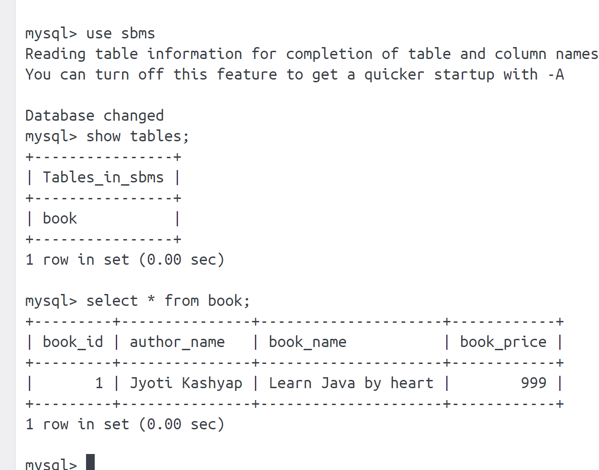

## How to Dockerize Spring Boot Application By Docker Compose
* **
 
###  What is Docker Compose
Docker Compose is a tool which is used to manage multi-container based application.

We can create multiple containers at a time by using Docker Compose.

Using Docker Compose we can define dependencies among the containers

	Ex: App Container Depends On DB Container

We will provide containers information to Docker Compose tool using
docker-compose.yml

Docker compose not created the docker image that why we need to create docker image first, then by using docker compose we create a docker container.

Docker Compose yml file contains below elements

	version: It represents version number

	services: It represents containers information

	volumes: It represents storage

	network: It represents connectivity


### Create Docker Container using Docker Compose YML
````
$ docker-compose up

$ docker-compose down

$ docker-compose stop

$ docker-compose start

$ docker-compose ps
````

### Docker Compose Setup 


### Download docker compose
```
$ sudo curl -L "https://github.com/docker/compose/releases/download/1.24.0/docker-compose-$(uname -s)-$(uname -m)" -o /usr/local/bin/docker-compose
```
### Give permissions
```
$ sudo chmod +x /usr/local/bin/docker-compose
```
### How to check docker compose is installed or not
```
$ docker-compose --version
```
* **
### Setup for Docker compose spring boot app

* Create docker image 
```agsl
 docker build -t spring-boot-mysql-app .
```
* Create docker container by using docker compose file
```agsl
docker-compose up

docker-compose up -d  (deattached mode)
```


### Checking Databse 
* login into shell either by using docker desktop or by using cmd
```agsl
docker exec -it mysql-docker bash
```
* login into shell
```agsl
mysql -uroot -proot
```


### Project Output

